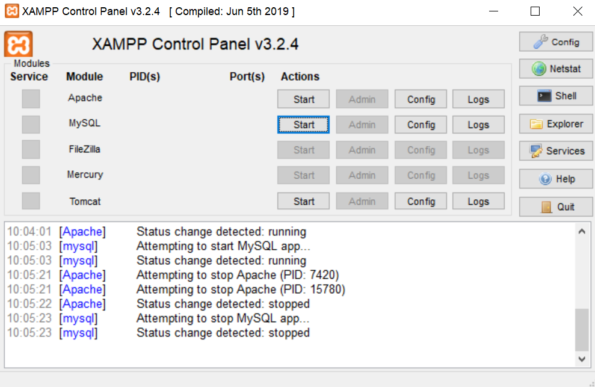
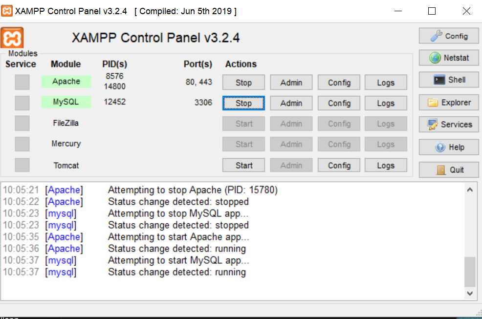
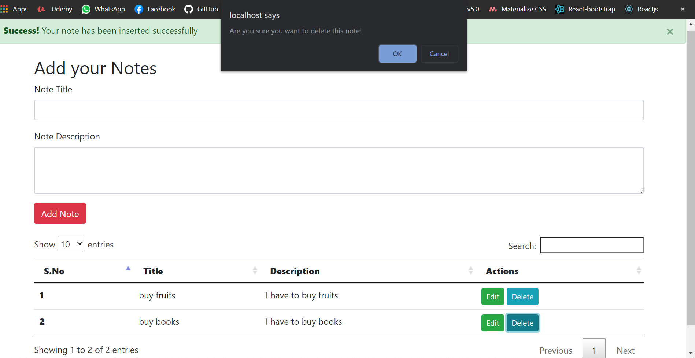
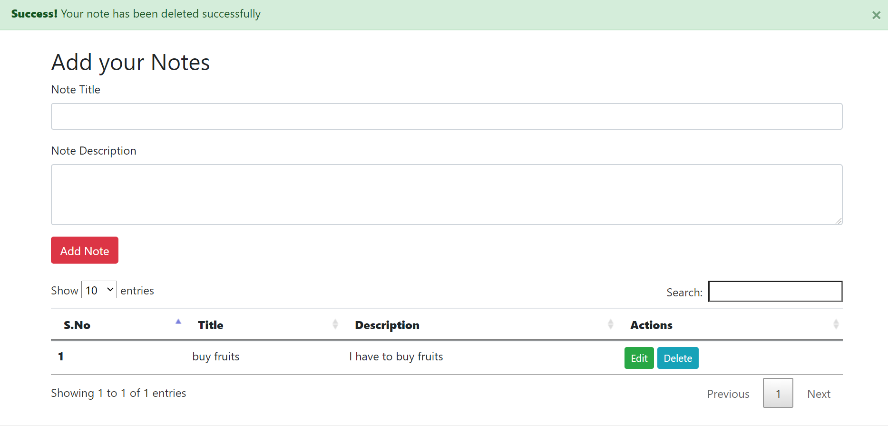
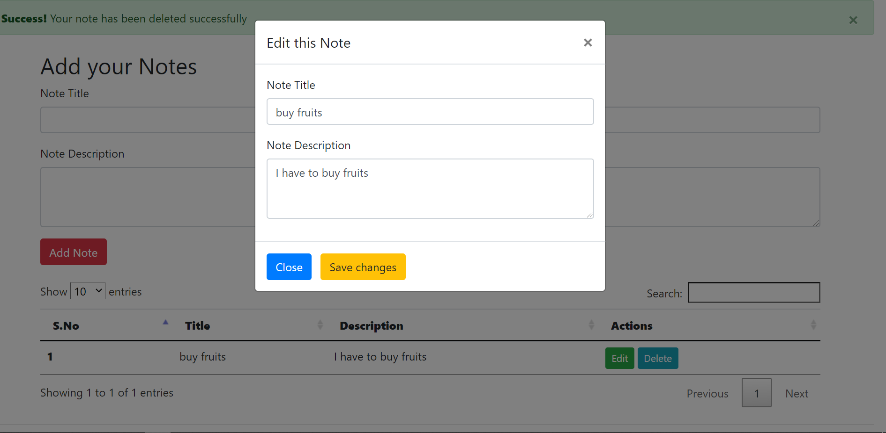
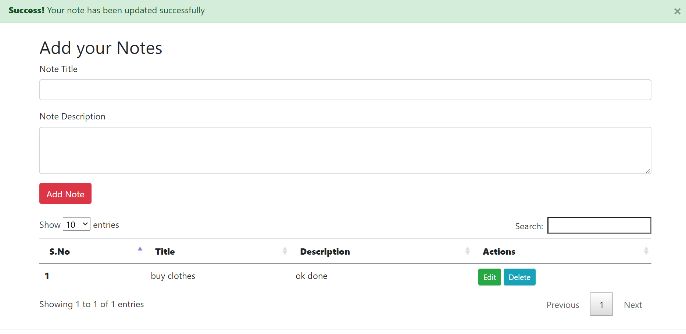
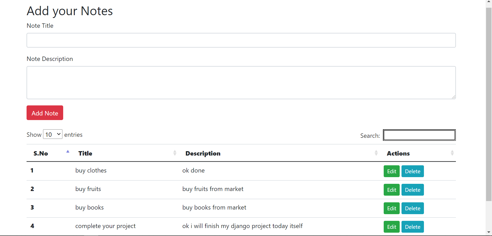
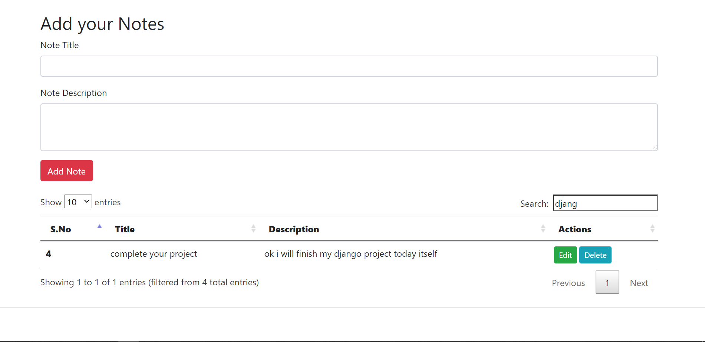

# CRUD Operation in PHP

Hello viewers, in this project I have demonstrated the CRUD operation on PHP by making a notes application ,it collects the notes title and description from the user and stores them in MySQL database then fetch it from there and display in the tabular format to the client's window , with Search option.

## Steps To follow 

### 1. Install Xampp Software that is pre-configured with PHP, Apache Server and MySQL Database

### 2. Start Apache Server and MySQL Database to store the input from client's window

### 3. Go to your project via localhost i.e your local Apache Server

### 4. Your screen will look like this 

## Creating a Note 

## Deleteing a Note

## Updating a Note

## Searching a Note

